<p align="center">
  
</p>


# Garden Engine

> 1년간의 커밋이 살아 있는 정원으로 피어납니다.

GitHub 잔디(contribution graph)를 픽셀아트 정원 애니메이션 SVG로 변환하는 엔진입니다.
꿀벌이 날아다니며 셀에 물을 주면, 커밋 수에 따라 새싹 → 잎 → 봉오리 → 만개 꽃으로 자라납니다.

<p align="center">
  
</p>

## How it works

```
GitHub GraphQL API  →  Contribution Grid  →  Simulation Engine  →  Animated SVG
     (commits)          (52x7 cells)        (bee pathfinding)     (CSS keyframes)
```

1. **Fetch** — GitHub GraphQL API에서 최근 1년 커밋 데이터를 가져옵니다
2. **Map** — 커밋 수를 사분위수 기반으로 0~4 레벨로 매핑합니다
3. **Simulate** — 꿀벌 액터가 BFS로 셀을 찾아 이동하며 물을 줍니다
4. **Render** — 5개 레이어(울타리, 흙, 성장, 이펙트, 액터)를 합성합니다

## Setup — GitHub Action (추천)

이 프로젝트는 **내 GitHub 프로필 README 레포**에 등록해서 씁니다.
즉, 이 저장소를 포크하거나 수정하는 게 아니라, **내 프로필용 저장소**에 워크플로우를 추가하는 방식입니다.

### 어디에 등록하나요?

GitHub 프로필에 보이는 README는 아래 조건을 만족하는 특별한 저장소입니다.

1. 저장소 이름이 **내 GitHub 아이디와 완전히 같아야 합니다**
2. 저장소가 **Public** 이어야 합니다
3. 루트에 `README.md` 가 있어야 합니다

예를 들어 GitHub 아이디가 `westkite1201` 이면 프로필 README 저장소 이름도 반드시 `westkite1201` 이어야 합니다.

이미 이런 저장소가 있다면 그 저장소에 아래 설정을 추가하면 됩니다.
없다면 먼저 만들어야 합니다.

### 1. 프로필 README 저장소 만들기

1. GitHub 우측 상단 `+` 버튼 클릭
2. `New repository` 클릭
3. `Repository name` 에 **내 GitHub 아이디와 같은 이름** 입력
4. `Public` 선택
5. `Add README` 켜기
6. `Create repository` 클릭

이 저장소가 곧 내 프로필에 노출되는 README 저장소입니다.

### 2. GitHub Token 만들기

이 액션은 GitHub GraphQL API로 내 contribution 데이터를 읽어와야 하므로 토큰이 필요합니다.

경로:
`GitHub 프로필 사진 → Settings → Developer settings → Personal access tokens`

권장 방식:

- 가능하면 **Fine-grained token**
- 최소 권한 원칙으로 생성
- 만약 동작 이슈가 있으면 **Tokens (classic)** 으로 다시 만들어 `read:user` scope를 주는 방식으로 대체

빠르게 설정하려면 아래 기준으로 만들면 됩니다.

#### Fine-grained token으로 만들 때

1. `Fine-grained tokens` 클릭
2. `Generate new token` 클릭
3. Token name 예시: `garden-engine`
4. Resource owner: 본인 계정 선택
5. Expiration: 원하는 기간 선택
6. Repository access: **Only select repositories**
7. 내 프로필 README 저장소 하나만 선택
8. Permissions는 읽기 중심으로 설정

이 프로젝트는 contribution 조회가 핵심이라, 토큰이 너무 제한적이면 API 호출이 막힐 수 있습니다.
그 경우 아래 classic token 방식이 가장 단순합니다.

#### Classic token으로 만들 때

1. `Tokens (classic)` 클릭
2. `Generate new token (classic)` 클릭
3. Note 예시: `garden-engine`
4. Expiration 선택
5. Scope에서 **`read:user`** 체크
6. 토큰 생성 후 바로 복사

### 3. Secret 등록

이제 방금 만든 토큰을 **프로필 README 저장소**에 secret으로 넣습니다.

경로:
`프로필 README 저장소 → Settings → Secrets and variables → Actions → New repository secret`

다음처럼 등록하세요.

- Name: `GH_TOKEN`
- Secret: 방금 생성한 토큰 값

### 4. 워크플로우 파일 추가

프로필 README 저장소에 아래 파일을 추가하세요.

파일 경로:
`.github/workflows/update-garden.yml`

```yaml
name: Update Garden

on:
  schedule:
    - cron: "0 0 * * *" # 매일 00:00 UTC, 한국 시간 09:00
  workflow_dispatch:

permissions:
  contents: write

jobs:
  generate:
    runs-on: ubuntu-latest
    steps:
      - uses: actions/checkout@v4

      - name: Generate garden SVG
        uses: westkite1201/garden-engine@v1
        with:
          github_token: ${{ secrets.GH_TOKEN }}
          # username: ""                # 비우면 토큰 소유자 기준
          # theme: spring               # 현재 spring 지원
          # output_path: assets/garden.svg

      - name: Commit and push garden
        run: |
          git config user.name "garden-bot"
          git config user.email "garden-bot@users.noreply.github.com"
          git add assets/garden.svg
          git diff --staged --quiet || git commit -m "chore: update garden"
          git push
```

중요:

- 이 파일은 **garden-engine 저장소가 아니라 내 프로필 README 저장소**에 넣어야 합니다
- `uses: westkite1201/garden-engine@v1` 는 이 저장소의 GitHub Action을 가져다 쓰는 줄입니다
- `output_path` 를 바꾸면 아래 README 이미지 경로도 같이 바꿔야 합니다

### 5. README.md에 이미지 삽입

이제 같은 프로필 README 저장소의 `README.md` 에 아래 마크업을 넣으세요.

```markdown
<p align="center">
  
</p>
```

보통은 README 상단이나 소개 문구 바로 아래에 넣는 게 가장 자연스럽습니다.

### 6. 처음 한 번 수동 실행해서 등록 확인

자동 스케줄을 기다리지 말고 먼저 한 번 직접 실행해서 등록이 맞는지 확인하는 게 좋습니다.

1. 프로필 README 저장소로 이동
2. `Actions` 탭 클릭
3. `Update Garden` 워크플로우 선택
4. `Run workflow` 클릭
5. 실행이 끝나면 저장소에 `assets/garden.svg` 파일이 생겼는지 확인
6. `README.md` 에 정원 SVG가 보이는지 확인
7. 내 GitHub 프로필 페이지로 가서 실제로 노출되는지 확인

여기까지 보이면 등록이 끝난 것입니다.

### 바로 확인할 체크리스트

- 프로필 README 저장소 이름이 내 GitHub 아이디와 정확히 같은가
- 저장소가 Public 인가
- `README.md` 가 루트에 있는가
- secret 이름을 `GH_TOKEN` 으로 넣었는가
- 워크플로우가 내 프로필 README 저장소에 들어갔는가
- README의 이미지 경로가 `assets/garden.svg` 와 일치하는가
- Actions 실행 후 실제로 `assets/garden.svg` 가 커밋되었는가

### 자주 막히는 문제

#### 1. Actions는 성공했는데 프로필에 안 보여요

대부분 아래 둘 중 하나입니다.

- 프로필 README 저장소 이름이 GitHub 아이디와 다름
- `README.md` 에 이미지 태그를 아직 안 넣었음

#### 2. `assets/garden.svg` 파일은 생겼는데 이미지가 안 보여요

보통 README에 적은 경로와 실제 출력 경로가 다릅니다.

- 워크플로우 `output_path`
- README의 ``

이 둘이 정확히 같아야 합니다.

#### 3. 401 / Unauthorized 에러가 나요

토큰 문제입니다.

- 토큰이 만료됨
- secret에 잘못 붙여넣음
- 권한이 부족함

이 경우 토큰을 새로 만들어 `GH_TOKEN` secret 값을 교체한 뒤 다시 실행하세요.

#### 4. 특정 사용자 기준으로 만들고 싶어요

기본값은 토큰 소유자입니다.
다른 사용자를 조회하려면 워크플로우에서 `username` 을 명시하세요.

```yaml
with:
  github_token: ${{ secrets.GH_TOKEN }}
  username: your-github-id
```

### Action Inputs

| Input | 필수 | 기본값 | 설명 |
|-------|------|--------|------|
| `github_token` | O | — | GitHub PAT (`read:user` scope) |
| `username` | X | `""` | GitHub 유저네임 (비워두면 토큰 소유자) |
| `theme` | X | `spring` | 정원 테마 |
| `output_path` | X | `assets/garden.svg` | SVG 출력 경로 |

## Local Development

```bash
# 클론 & 설치
git clone https://github.com/westkite1201/garden-engine.git
cd garden-engine
npm install

# 환경변수 설정
cp .env.sample .env
# .env 파일에 GITHUB_TOKEN 입력

# 빌드 & 생성
npm run generate
```

`assets/garden.svg`에 결과물이 저장됩니다.

```bash
# 테마 지정
npm run build && npm start -- --theme=spring
```

## Output

자체 포함된 단일 SVG 파일 (외부 리소스 불필요):

- CSS `@keyframes` 애니메이션 내장
- `viewBox` 기반 반응형 스케일링
- GitHub README / 웹페이지 / 어디든 임베드 가능

## Growth Stages

커밋 활동에 따라 4단계로 성장합니다:

```
 Lv1 새싹        Lv2 잎          Lv3 봉오리       Lv4 만개
    ·              ·G·              p             p · p
   ·G·            · G ·            ppp           ppCpp
    G               G              gGg            ppp
    G               G               G             gGg
                    G                G              G
                                     G              G
```

| Level | 기준 | 색상 |
|-------|------|------|
| 0 (흙) | 커밋 없음 | `#161b22` |
| 1 | 하위 25% | `#0e4429` |
| 2 | 25~50% | `#006d32` |
| 3 | 50~75% | `#26a641` |
| 4 | 상위 25% | `#39d353` |

꽃은 6가지 색상 중 셀 위치에 따라 결정됩니다:
체리블로썸 핑크, 라벤더, 코랄, 스카이블루, 오렌지, 자홍

## Theme System

`ThemePack` 인터페이스로 테마를 확장할 수 있습니다:

| 속성 | 설명 |
|------|------|
| `palette` | 배경, 흙, 레벨 1~4, 액센트 색상 |
| `tiles` | 각 성장 단계의 SVG 셰이프 |
| `actor` | 캐릭터 스프라이트 (SVG + 크기) |
| `effects` | 인트로/아웃트로 이펙트 |
| `rules` | 체류 시간, 액터 수, 셀 이동 속도 |

현재 포함된 테마: **Spring Garden** (꿀벌 + 6종 꽃)

## Project Structure

```
src/
├── app/           # 메인 오케스트레이터 & 테스트 생성기
├── config/        # 그리드 레이아웃 & 타이밍 상수
├── engine/        # 시뮬레이션 엔진 (타입, 컨텍스트, 플래너, 시뮬레이터, 타임라인)
├── github/        # GitHub GraphQL API 연동
├── grid/          # 기여 데이터 → 그리드 셀 매핑
├── svg/
│   ├── layers/    # 5개 렌더링 레이어 (울타리, 흙, 성장, 이펙트, 액터)
│   └── render/    # SVG 합성
└── theme/         # 테마 시스템 (타입, 레지스트리, spring 테마)
```

## Tech Stack

- **TypeScript** (ES2022, strict)
- **Node.js** >= 18
- GitHub GraphQL API
- CSS Keyframe Animations
- Zero runtime dependencies (dotenv only)

## PR 기록

| 날짜 | 주제 | 링크 |
|------|------|------|
| 2026-03-27 | README + GitHub Action + 정원 장식 추가 | [docs/pr/2026-03-27-add-readme-svg.md](docs/pr/2026-03-27-add-readme-svg.md) |
| 2026-03-26 | Garden Engine MVP 구현 | [docs/pr/2026-03-26-garden-engine-mvp.md](docs/pr/2026-03-26-garden-engine-mvp.md) |

## Inspired by

[green-movement](https://github.com/SeoNaRu/green-movement) — 양이 잔디를 뜯어먹는 SVG 애니메이션에서 영감을 받아, 벌이 꽃을 피우는 성장 모델로 재해석했습니다.

## License

MIT

